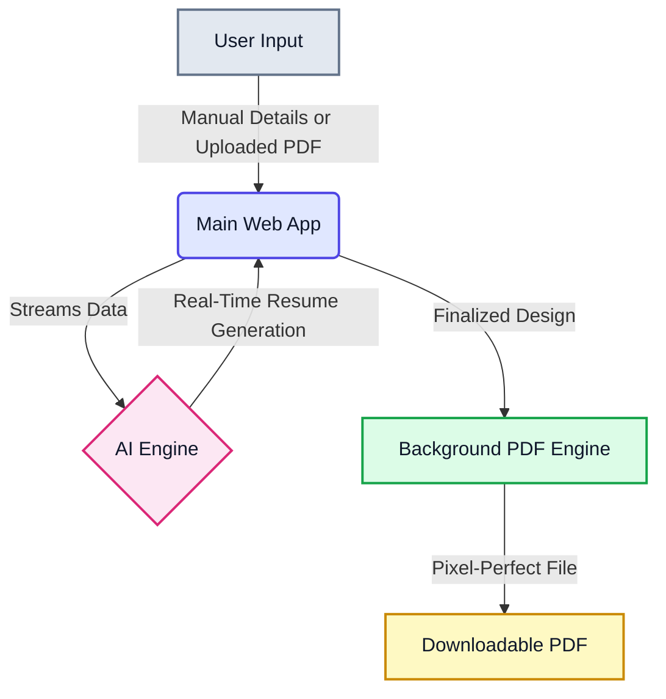

# GenX - AI Resume Builder

GenX is an intelligent, easy-to-use resume builder that takes your raw experience and automatically transforms it into a highly polished, ATS-friendly professional resume.

---

## Problem Statement

Crafting a professional resume is often a frustrating and time-consuming process. Job seekers struggle to distill their diverse experiences into impactful achievements, and existing tools frequently produce poorly formatted documents that fail Applicant Tracking Systems (ATS) or look broken when printed. 

**GenX** solves this by automatically writing your content using industry-standard formulas and ensuring your final PDF looks perfect and works flawlessly.

---

## Key Features

* **Smart Data Entry**: Type in your basic details, or upload an existing PDF resume to instantly extract your information.
* **Job Description Tailoring**: Paste the job you want, and GenX will automatically weave the right keywords into your resume to help you pass the ATS filters.
* **Pro-Level Writing (Google Formula)**: Our AI automatically rewrites your bullet points using the famous "Accomplished X, by doing Y, resulting in Z" formula to highlight your real impact.
* **Real-Time Live Preview**: Watch your resume build itself instantly as the AI writes. No more waiting screens!
* **Perfect Multi-Page Layouts**: Stop worrying about awkward page breaks or headings left alone at the bottom of a page. GenX automatically shifts content to ensure your resume always looks clean and readable.
* **Flawless PDF Export**: Download a true, pixel-perfect A4 PDF where the output formatting matches the screen exactly.
* **Interactive Design Studio**: Easily reorder sections, tweak fonts, and adjust margins with a few clicks.

---

## System Architecture & Design Summary

This section provides a high-level overview of how GenX is built, how the AI works under the hood, and the key decisions we made to ensure a seamless user experience.

### System Flow & Architecture

GenX is built on a modern, decoupled architecture designed for speed and reliability. Instead of cramming everything into one system, we split the application into three main layers:



1. **The Web App (The Interface)**: Where the user logs in, edits their content, and manages their resumes. It handles the interactive studio where users drag, drop, and tweak their designs on a live preview canvas.
2. **The AI Engine (The Brain)**: Connects to advanced AI models to read, understand, and rewrite the user's experience into a highly professional format.
3. **The PDF Engine (The Printer)**: A completely separate background service whose sole job is to take the web design and convert it into a flawless, standard A4 PDF document.

---

### AI Integration

Our AI integration goes far beyond simple text generation. We built it to act like an elite executive resume writer. 

* **Smart Data Extraction**: If a user uploads an old, messy resume, the system extracts the raw text and feeds it to the AI, which automatically cleans it up and categorizes everything into skills, education, and experience.
* **Job Description Tailoring**: When a user pastes a job they want, the AI analyzes the required skills and naturally weaves those exact keywords into the resume to help bypass automated corporate filters.
* **Metric-Driven Bullet Points**: We engineered the AI's system prompt to transform passive job descriptions into action-oriented statements. The model automatically extracts and emphasizes key performance metrics, percentages, and data points to ensure the candidate's actual business impact takes center stage.
* **Live Streaming**: Waiting for an AI to finish thinking can be boring. We integrated a "streaming" connection, meaning the user watches their resume write itself on the screen in real-time, section by section.

---

### Key Design Decisions

Throughout the development of GenX, we made several intentional choices to solve common frustrations with existing resume builders.

1. **No More Awkward Page Breaks**
   * *The Problem*: Most builders simply slice your resume at the bottom of the page, sometimes cutting a sentence in half or leaving a section title stranded by itself on the previous page.
   * *Our Decision*: We built an intelligent measurement system that constantly checks how much space is left. If a job experience doesn't fit, it automatically moves it - and its title - to the next page, keeping everything clean, connected, and readable.

2. **A Dedicated PDF Engine**
   * *The Problem*: Converting web pages to PDFs usually relies on the user's browser, which often messes up margins, colors, and makes links unclickable.
   * *Our Decision*: We built a completely separate background engine to handle exporting. It forces the document into a strict A4 size and ensures that every email and portfolio link remains clickable in the final file.

3. **Distraction-Free Interface**
   * *The Decision*: Building a resume is stressful. We designed the interface to be calm, spacious, and minimalist. We used soft frosted-glass effects and muted colors so the user's focus stays entirely on their content and the live preview, rather than on a cluttered editing menu.

4. **Real-Time Typography & Layout Controls**
   * *The Problem*: Most resume generators lock users into rigid templates where everything from font sizes to margins is fixed. If your text is slightly too long, you have no way to tweak the spacing to make it fit.
   * *Our Decision*: We built an interactive Design Studio that gives users granular control over their resume's visual aesthetics. Users can instantly switch font families, scale font sizes, and adjust line spacing or margins on the fly. Because of the live-rendering canvas, they immediately see how these micro-adjustments affect their page layouts.

---

## How to Run It Locally

### 1. Requirements
* **Node.js** installed on your computer.
* A **MongoDB** database (local or Atlas).
* A **Mimo API Key** (for the AI features).

### 2. Setup

First, clone the repository:
```bash
git clone https://github.com/your-username/genx.git
cd genx
```

### 3. Install & Start

Open two terminal windows.

**Terminal 1 (Start the PDF Exporter):**
```bash
cd pdf-service
npm install
node index.js
```

**Terminal 2 (Start the Main App):**
```bash
npm install
npm run dev
```

Visit **http://localhost:3000** in your browser to start building!

---

## How to Use

1. **Getting Started**: Head over to the landing page and log in. Once inside the dashboard, you can view your saved resumes or start a new one by clicking the "Create Resume" button.
2. **Data Entry & Generation**: 
   - *Manual Mode*: Type in your work history, education, and skills. Use the builtin guide for tips on writing high-impact bullet points.
   - *PDF Extractor*: Alternatively, upload an existing PDF resume to have the system automatically extract and structure your details.
   - *Tailoring*: Paste a target Job Description to allow the AI to align your experience with what the employer is looking for.
   - Click "Generate Resume" and watch as the AI intelligently formats and writes your content in real-time.
3. **Refining in the Studio**: Once generated, you'll enter the interactive split-pane studio. Here, you can:
   - Drag and drop to reorder sections (e.g., move Education above Experience).
   - Tweak fonts, adjust line spacing, and change margin sizes for the perfect look.
   - Manually edit any text generated by the AI if you want to make final personal adjustments.
4. **Final Export**: When everything looks perfect on the live A4 canvas, simply click the export button. GenX will instantly generate and download a clean, ATS-optimized PDF ready for your job applications.
